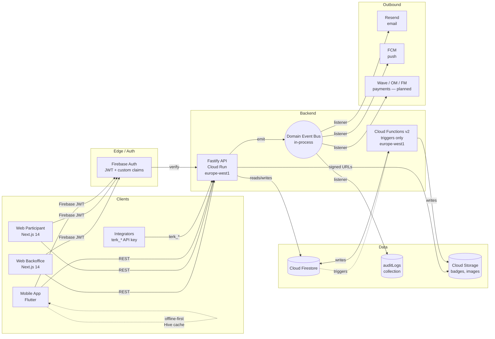

# Architecture overview

Macro view of how the Teranga monorepo's pieces connect, who calls whom, and where state lives. Cross-link with [`overview.md`](../overview.md) for the prose-heavy version and the ADR index at [`decisions/README.md`](../decisions/README.md) for the rationale behind each piece.

## Component diagram

## What lives where

| Concern | Component | Why |
|---|---|---|
| HTTP routes (~200) | `apps/api` (Cloud Run) | Always-on, no cold starts ([ADR-0001](../decisions/0001-cloud-run-vs-functions.md)) |
| Background side effects (audit, notifications, future webhooks) | Domain event bus inside the API | Decoupling without overhead ([ADR-0010](../decisions/0010-domain-event-bus.md)) |
| Firestore triggers (badge generation, denormalization) | `apps/functions` | Cold starts acceptable for fire-and-forget |
| Auth | Firebase Auth + custom claims | RBAC subject to ADR-0011 + multi-tenancy ADR-0012 |
| Schemas / types | `packages/shared-types` | Single source of truth ([ADR-0002](../decisions/0002-zod-single-source-of-truth.md)) |
| UI components | `packages/shared-ui` | Reused by both Next.js apps |
| Tailwind preset + ESLint | `packages/shared-config` | Brand-locked tokens, no per-app forks |

## Data flow rules

- **API is the only writer for org-scoped data.** Web and mobile clients do not write to Firestore directly except for self-data (FCM token registration, profile photo).
- **Firestore rules enforce defense in depth** alongside service-level checks ([ADR-0005](../decisions/0005-deny-all-firestore-rules.md), [ADR-0012](../decisions/0012-multi-tenancy-via-organization-id.md)).
- **All timestamps are ISO 8601 strings** ([ADR-0009](../decisions/0009-iso-8601-timestamps.md)).
- **No hard deletes** ([ADR-0008](../decisions/0008-soft-delete-only.md)).
- **Mobile is offline-first** for QR scanning — cached Firestore data + Hive write queue.

## Deployment topology

| Component | Target | Region |
|---|---|---|
| `apps/api` | Cloud Run | `europe-west1` |
| `apps/functions` | Firebase Cloud Functions v2 | `europe-west1` |
| `apps/web-backoffice` | Firebase Hosting (`default` site) | global CDN |
| `apps/web-participant` | Firebase Hosting (separate site) | global CDN |
| `apps/mobile` | Play Store + App Store | n/a |

Region pinning to `europe-west1` keeps Senegal-edge latency at ~80 ms and colocates compute with Firestore storage. See CLAUDE.md → "Common Pitfalls" §5.
