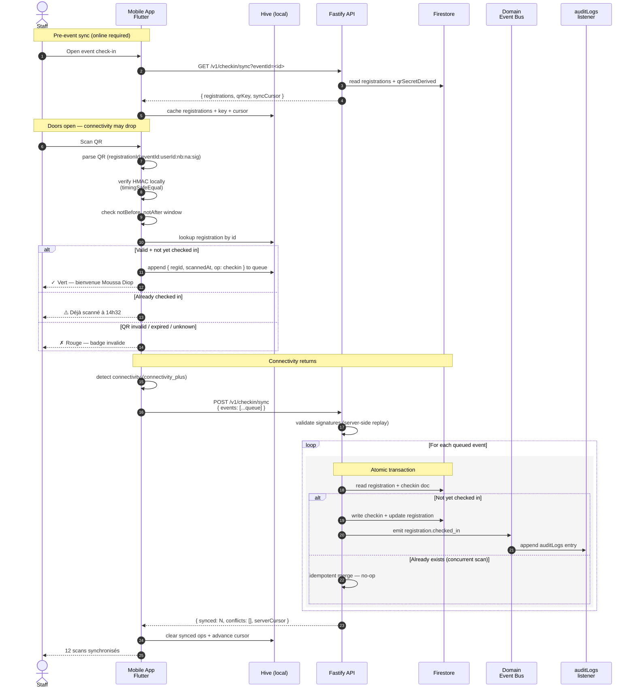

# Offline check-in flow

The platform's **core differentiator**: reliable QR badge scanning at events held in venues with intermittent connectivity. Below is the sequence from "staff opens the scanner" to "check-in syncs back when connectivity returns."

> Today the offline scanner ships in the **mobile** app (Wave 9 — currently planned). The web backoffice has an online-only check-in dashboard and a manual fallback. The flow below describes the mobile path.

## Sequence diagram

## Key invariants

| Invariant | Where enforced |
|---|---|
| QR is unforgeable offline | HMAC-SHA256 with derived per-event key cached in Hive at sync time. Local `timingSafeEqual` verify ([ADR-0003](../decisions/0003-qr-v4-hkdf-design.md)) |
| Scan window respected | `notBefore..notAfter` baked into the QR payload (v3+); v2/v1 fall back to `event.startDate − 24h .. event.endDate + 6h` |
| Offline check-ins are idempotent | Each queued op carries `(registrationId, scannedAt)`; server-side merge dedupes on `registrationId` |
| Concurrent scans (two devices) resolve deterministically | Last-write-wins on `checkinAt`; both devices see the canonical `checkedInAt` post-sync |
| No drop on first sync | Hive queue persists across app restarts; cursor only advances after server ACK |
| Audit log has an entry per check-in | Domain event bus fires `registration.checked_in` after the transaction commits ([ADR-0010](../decisions/0010-domain-event-bus.md)) |

## Failure modes

| Scenario | Behavior |
|---|---|
| Staff goes offline before initial sync | App refuses to enter check-in mode (no cached registrations to validate against). Visible warning: "Vous devez synchroniser au moins une fois". |
| Battery dies, app restarts | Hive queue persists; cursor unchanged; resync on next open |
| Conflicting check-ins from web admin (manual) + mobile scan | Server-side transaction wins; mobile sees the conflict in `conflicts[]` and surfaces it as a warning |
| Sync bandwidth poor | Sync chunked into batches of 50 ops; partial progress is durable |
| QR encrypted v4 in a future version | Fallback path: app can still verify but the rotation cadence applies — see [ADR-0004 ECDH X25519](../decisions/0004-offline-sync-ecdh-encryption.md) |

## Storage budget on the device

For a 5,000-attendee event:

- ~600 KB Hive cache for registrations (id, name, photo URL, status).
- ~32 bytes per queued op × 5,000 max scans ≈ 160 KB.
- **Total: under 1 MB.** Acceptable on entry-level Android devices.

## Related references

- [`docs-v2/30-api/checkins.md`](../../30-api/checkins.md)
- [`docs-v2/40-clients/mobile-flutter.md`](../../40-clients/mobile-flutter.md)
- [ADR-0003 QR v4 HKDF](../decisions/0003-qr-v4-hkdf-design.md)
- [ADR-0004 Offline sync ECDH X25519](../decisions/0004-offline-sync-ecdh-encryption.md)
- CLAUDE.md → "QR Badge Security"
