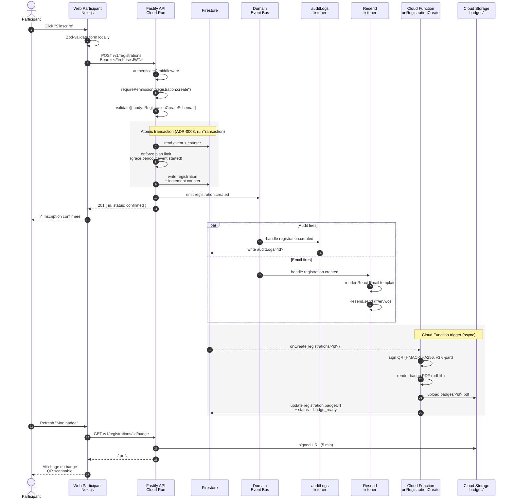

# Registration → Badge flow

End-to-end sequence from a participant submitting a registration to receiving their signed QR badge. Defense-in-depth checks happen at four layers (client validation, API layer, transactional commit, Cloud Function trigger).

## Sequence diagram

## Key invariants

| Invariant | Where enforced |
|---|---|
| Participant can register only if event is `published` and registration window is open | API service `register()` + Firestore rules |
| Plan limit (`maxParticipantsPerEvent`) respected | API service inside the transaction, with grace period after event start ([ADR-0006](../decisions/0006-denormalized-plan-limits.md)) |
| Registration count is exact (no double-increment, no lost increment) | `db.runTransaction()` reads counter + writes new value atomically |
| QR signature is unforgeable | HMAC-SHA256 with `QR_SECRET`, full digest, `crypto.timingSafeEqual` verification ([ADR-0003](../decisions/0003-qr-v4-hkdf-design.md)) |
| Audit log has an entry for every registration | Domain event bus emits unconditionally; audit listener writes to `auditLogs` ([ADR-0010](../decisions/0010-domain-event-bus.md)) |
| Confirmation email is fire-and-forget | Email listener errors do not roll back the registration |
| Badge file is private | Cloud Storage signed URL, 5-min TTL |

## Failure modes

| Scenario | Behavior |
|---|---|
| API restarts mid-transaction | Firestore rolls back; client gets 5xx and retries; counter stays consistent |
| Email send fails | Logged at `level: error`, audit log still written, registration is still confirmed; user can re-trigger from "Mes inscriptions" |
| Cloud Function badge generation fails | Registration stays at `status: confirmed`; retry via the `regenerate badge` admin tool; participant sees a "Badge en cours de génération" placeholder |
| User refreshes between API success and listener completion | Audit + email may not have fired yet (~100 ms latency); not user-visible because the API has already responded |
| Plan limit hit | API returns `409 PlanLimitError`; web app shows a localized error banner via `useErrorHandler()` |

## Related references

- [`docs-v2/30-api/registrations.md`](../../30-api/registrations.md)
- [`docs-v2/30-api/badges.md`](../../30-api/badges.md)
- [ADR-0003 QR v4 HKDF](../decisions/0003-qr-v4-hkdf-design.md)
- [ADR-0006 Denormalized plan limits](../decisions/0006-denormalized-plan-limits.md)
- [ADR-0008 Soft-delete only](../decisions/0008-soft-delete-only.md)
- [ADR-0010 Domain event bus](../decisions/0010-domain-event-bus.md)
